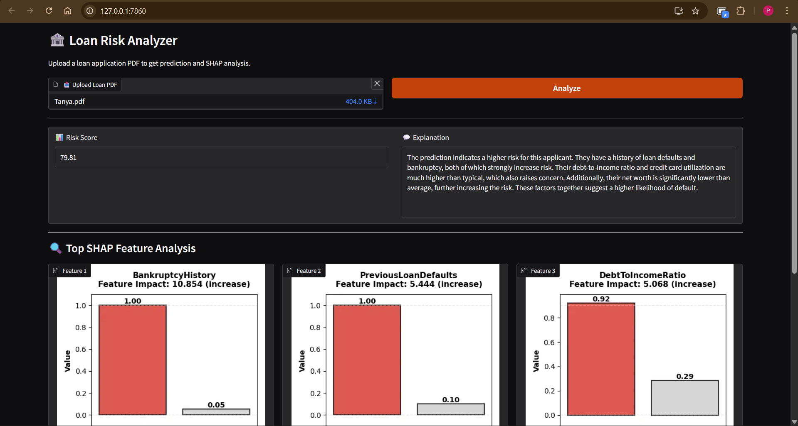

# Loan Risk Analysis

A comprehensive machine learning system for analyzing and predicting loan default risk with explainable AI insights and LLM-powered explanations.

## Overview

This project combines **XGBoost** for risk prediction with **Qwen3-4B LLM** for generating human-readable explanations. It processes loan applications, calculates risk scores (0-100), and provides detailed feature impact analysis through a user-friendly web interface.

### Key Features

- **Risk Scoring**: XGBoost-based risk prediction with continuous scores (0-100)
- **SHAP Explainability**: Feature importance and impact direction analysis
- **LLM Explanations**: Qwen3-4B generates context-aware risk explanations
- **PDF Processing**: Extracts applicant data from loan application PDFs
- **Web UI**: Interactive Gradio interface for real-time predictions
- **Production Ready**: Modular architecture with clear separation of concerns

## Web Interface



*The Gradio-based web interface showing risk score calculation (79.81) with detailed AI-generated explanation*

## Project Structure

```
loan_risk_analysis/
├── src/
│   ├── model/
│   │   ├── core/                  # Core prediction engine
│   │   │   ├── load_model.py      # XGBoost model loader & inference
│   │   │   ├── xgboostmodel.json  # Model architecture
│   │   │   └── xgboostmodel.pkl   # Trained model weights
│   │   ├── preprocessing/         # Data preprocessing artifacts
│   │   │   ├── encoder.pkl        # Label encoders for categorical features
│   │   │   ├── scaler.pkl         # StandardScaler for numerical features
│   │   │   ├── features.pkl       # Feature list and ordering
│   │   │   └── important_features.txt
│   │   ├── llm/                   # LLM components for explanations
│   │   │   ├── load_llm.py        # LLM loader & text generation
│   │   │   ├── SYSTEM_PROMPT.txt  # System prompt for LLM context
│   │   │   └── corr.json          # Feature correlations with risk
│   │   ├── analysis/              # Analysis artifacts
│   │   │   ├── describe.json      # Feature statistics & ranges
│   │   │   ├── correlations.csv   # Feature correlations
│   │   │   └── correlation_with_risk_score.json
│   │   ├── ui/                    # User Interface
│   │   │   └── gardio.py          # Gradio web interface
│   │   └── notebooks/             # Jupyter notebooks
│   │       ├── load.ipynb         # Data loading & exploration
│   │       └── train.ipynb        # Model training & evaluation
│   ├── prediction/
│   │   └── pdf_loader.py          # PDF parsing & data extraction
│   └── utils/                     # Utility functions
├── data/
│   ├── raw/                       # Original datasets
│   │   ├── Loan.csv              # Main dataset
│   │   ├── accepted.csv          # Accepted applications
│   │   └── rejected.csv          # Rejected applications
│   ├── processed/                # Processed & transformed data
│   └── predictions/              # Prediction outputs & test data
├── models/
│   └── artifacts/                # Pre-trained model artifacts
├── docs/
│   ├── notebooks/                # Documentation notebooks
│   └── notes.txt                 # Technical notes & learnings
├── cache/                        # HuggingFace model cache
├── config/                       # Configuration files
└── README.md
```

## Getting Started

### Prerequisites

- Python 3.8+
- 8GB+ RAM (for LLM inference)
- GPU recommended (CUDA 11.0+ for faster inference)
- ~8GB disk space (for model cache)

### Installation

1. **Clone & Setup**
   ```bash
   cd loan_risk_analysis
   python -m venv .venv
   
   # Windows
   .venv\Scripts\activate
   
   # macOS/Linux
   source .venv/bin/activate
   ```

2. **Install Dependencies**
   ```bash
   pip install -r requirements.txt
   ```

3. **Download Models** (automatic on first run)
   - XGBoost model artifacts will be loaded from `src/model/core/`
   - LLM (Qwen3-4B) will be downloaded to `./cache/`

### Quick Start

**Run the Web Interface:**
```bash
python -m src.model.ui.gardio
```
Then open `http://localhost:7860` in your browser

**Programmatic Usage:**
```python
from src.model.core.load_model import predict
from src.prediction.pdf_loader import prediction_dataframe

# Load and predict
df = prediction_dataframe()
risk_score, explanation = predict(df)
print(f"Risk Score: {risk_score:.2f}")
print(f"Explanation: {explanation}")
```

## How It Works

### 1. **Data Processing**
   - Categorical features encoded with LabelEncoder
   - Numerical features scaled with StandardScaler
   - Features selected based on importance analysis

### 2. **Risk Prediction**
   - XGBoost model predicts continuous risk scores (0-100)
   - SHAP explains top 5 features driving the prediction
   - Direction of impact identified (increases/decreases risk)

### 3. **Explanation Generation**
   - Feature context extracted from `describe.json` (mean, range, percentiles)
   - LLM generates natural language explanation
   - Factors considered:
     - Feature values vs. applicant values
     - Deviation from typical applicants
     - Impact direction on risk score

### 4. **PDF Processing**
   - Extracts tabular data from loan application PDFs
   - Maps fields to model features
   - Handles missing values

## Key Technical Insights

### Data Quality & Leakage
- **Issue Found**: LoanApproval field had unusually high feature importance
- **Root Cause**: Data leakage - approval status shouldn't predict risk
- **Solution**: Removed from feature set during preprocessing

### Scaling Strategy
- **StandardScaler**: Used for linear models
- **MinMaxScaler**: Used for complex models (XGBoost)
- Rationale: StandardScaler transforms to mean=0, std=1; MinMaxScaler handles outliers better

## Core Dependencies

```
PyTorch 2.10.0              # Deep learning framework
Transformers 5.3.0          # HuggingFace LLM framework
XGBoost 3.2.0               # Gradient boosting
scikit-learn 1.8.0          # ML preprocessing & utilities
pandas 2.3.3                # Data manipulation
numpy 2.3.5                 # Numerical computing
SHAP 0.51.0                 # Explainability
Gradio 6.10.0               # Web UI
BitsAndBytes 0.49.2         # Model quantization
Accelerate 1.13.0           # Distributed training
PyPDF 6.9.2                 # PDF parsing
joblib 1.5.3                # Model serialization
```

See `requirements.txt` for complete list.

## Usage Examples

### Example 1: Single Prediction
```python
from src.prediction.pdf_loader import prediction_dataframe
from src.model.core.load_model import predict
from src.model.llm.load_llm import generate_text
import json

# Get prediction data
df = prediction_dataframe()

# Get risk score and feature explanation
risk_score, features_text = predict(df)

# Generate LLM explanation
with open("src/model/llm/SYSTEM_PROMPT.txt") as f:
    system_prompt = f.read()

explanation = generate_text(features_text, system_prompt)
print(f"Risk Score: {risk_score:.2f}/100")
print(f"Explanation: {explanation}")
```

### Example 2: Batch Processing
```python
import pandas as pd
from src.model.core.load_model import predict

predictions = []
for idx, row in df.iterrows():
    risk_score, _ = predict(pd.DataFrame([row]))
    predictions.append({
        'applicant_id': row['id'],
        'risk_score': risk_score,
        'risk_category': 'High' if risk_score > 70 else 'Medium' if risk_score > 40 else 'Low'
    })

results_df = pd.DataFrame(predictions)
results_df.to_csv('data/predictions/batch_results.csv', index=False)
```

## Configuration

### Model Selection
Edit `src/model/llm/load_llm.py`:
```python
MODEL_NAME = "Qwen/Qwen3-4B"  # or "Qwen/Qwen2.5-1.5B" for faster inference
```

### LLM Parameters
Adjust in `src/model/llm/load_llm.py`:
```python
pipe = pipeline(
    "text-generation",
    max_new_tokens=300,      # Response length
    temperature=0.3,         # Determinism (0=exact, 1=creative)
    top_p=0.8,              # Nucleus sampling
)
```

## Model Performance

- **Training Data**: 8,363 loan applications
- **Test Data**: 2,091 applications
- **Features**: 13 categorical & numerical features
- **Model Type**: XGBoost Regression (RMSE optimization)
- **Output Range**: 0-100 risk score

## Troubleshooting

### Out of Memory Error
```bash
# Use smaller model
# In src/model/llm/load_llm.py, change to:
MODEL_NAME = "Qwen/Qwen2.5-1.5B"
```

### Slow Predictions
- First inference loads model into memory (~2-3 minutes)
- Subsequent predictions are fast (~5-10 seconds)
- GPU recommended for faster inference

### PDF Processing Issues
- Ensure PDF has tabular data
- Check `src/prediction/pdf_loader.py` for supported formats

## Development

### Run Tests
```bash
pytest tests/ -v
```

### Reprocess Data
```bash
python src/model/notebooks/load.ipynb  # Extract features
python src/model/notebooks/train.ipynb # Train model
```

### Add New Features
1. Update datasets in `data/raw/`
2. Retrain model via notebook
3. Update `src/model/preprocessing/features.pkl`
4. Update `src/model/analysis/describe.json`

## References

- [XGBoost Documentation](https://xgboost.readthedocs.io/)
- [SHAP Paper](https://arxiv.org/abs/1705.07874)
- [Qwen Models](https://huggingface.co/Qwen)
- [Gradio Docs](https://gradio.app/)

## License

This project is provided as-is for educational and evaluation purposes.

## Contributing

For improvements or bug reports, please create an issue or submit improvements.

## Support

For questions or issues, check the `docs/notes.txt` file for technical insights and troubleshooting tips.

---

**Last Updated**: March 2026
**Status**: Production Ready